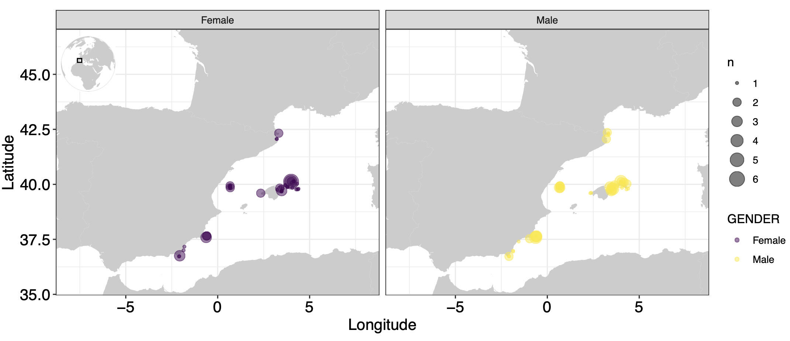
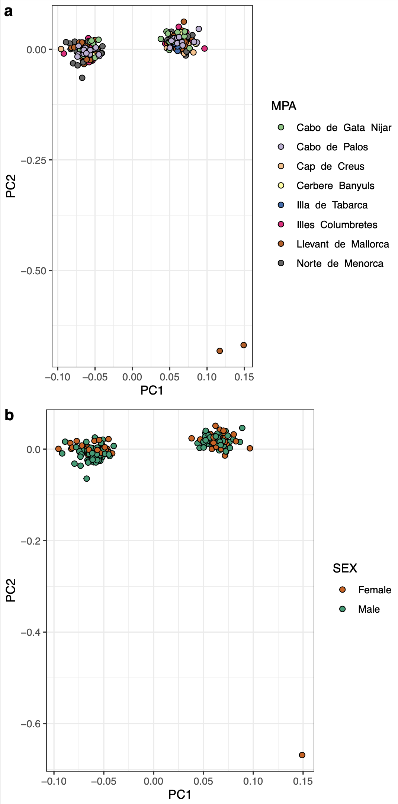
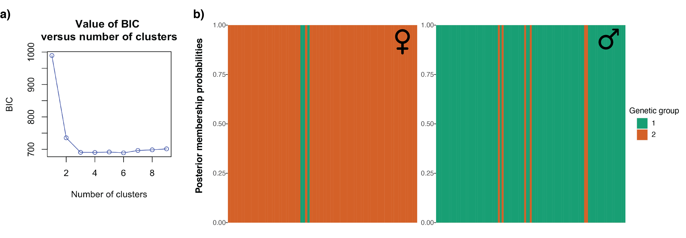
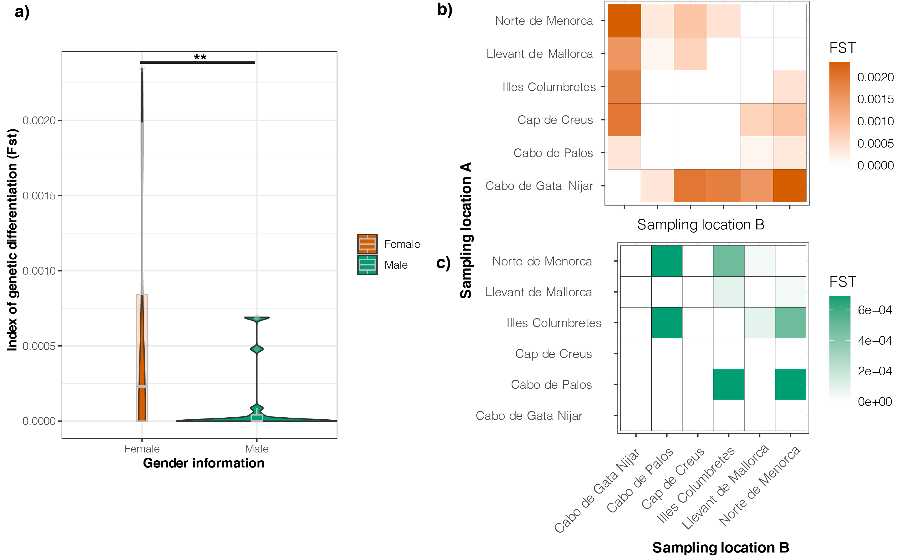
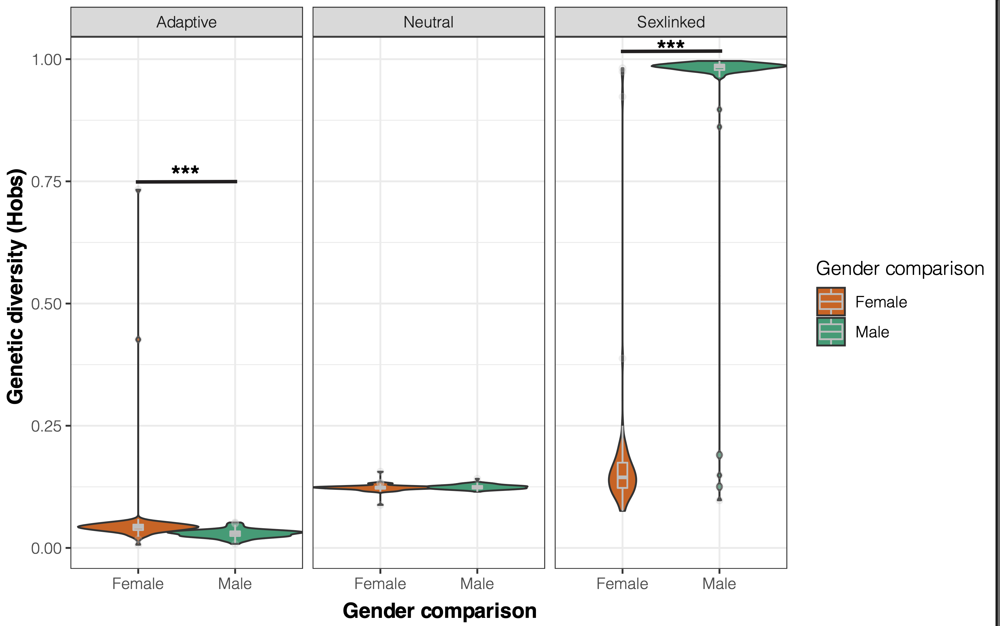

# sex_lobster
Investigating the influence of fishing on male and female lobster.

## 1. Sampling

</img>

## 2. Outlier detection

We use `pcadapt`to test for local adaptation in *P. elephas*.
We apply a conservative cut-off by selecting only markers in the top 1% of the P-values distribution.
We discover a total of 833 snps putatively under divergent selection out of 83372snps genotyped on 243 individuals.

</img>

## 3. Population structure

### Adaptive population structure

Using ADMIXTURE and a Discriminant Analysis of Principal Components (DAPC) available in the [adegenet package](https://www.rdocumentation.org/packages/adegenet/versions/2.0.1), we run our script `adaptive_structure`. 
We observe complete panmixia, which is likely due to the life history traits of this species (e.g. long pelagic duration phase). This result consider all the putatively neutral genetic markers (25230 SNPs).

We decide to look for population structure using the set of SNPs putatively under divergent selection by performing the script `adaptive_structure.R`.
When we look at these highly differentiated regions of the genome, we highlight that 272 SNPs are linked to gender information, meaning that these markers are probably located to sex chromosome (hereafter called sex-linked markers) and in autosome.

</img>

## 4. Sex-bias dispersal

According to theory, polygamous mating systems tend to trigger male-bias dispersal but studies on sex-biased in the marine realm have only focused on fish (Hutchings and Gerber 2002), sharks (Pardini et al. 2001) and marine mammals (Möller and Beheregaray 2004, Ball et al. 2017), with little attention to marine invertebrate (Teske et al. 2012) and never on crustacean. 
Population genetic theory predicts that the amount of relatedness and genetic differentiation is higher for the sex that disperse the less while the sex that disperse the most can show complete panmixia. 
Here, we estimated FST and relatedness values in order to test this theory on our dataset.

</img>

Then, we investigate the hypothesis of sex-bias dispersal by calculating the degree of relatedness for male and female, separately.
We detect a subtle difference, males being less relative than female, but it turns out that this difference is not significant (Wilcoxon test, P-value = 0.10).

## 5. Sex-linked markers

Using a logistic regression, we identify a total of 277 SNPs putatively linked to sex chromosomes, out of the 833 adaptive SNPs originally detected. 
We estimate the genetic diversity among these markers using the 277 SNPs, 556 SNPS (833 - 277 SNPs) and the 25,230 SNPs previously developed in Benestan et al. (2021).

</img>

We uncover a difference in genetic diversity between males and females, using the script `script-het-sex.r`.
Females show higher genetic diversity than male, even when we consider moderate sex-linked markers (putative X linked) .
To complement this analysis, we estimate the effective size of the females and males separately, using [COLONY](https://www.zsl.org/science/software/colony) and [NeEstimator](http://www.molecularfisherieslaboratory.com.au/neestimator-software/). 

----------------------------------------------------------------------------------------------------
Estimates by Colony full likelihood method : Assuming random mating
|----------------------------------------------------------|
|Female|
|Ne      =         12960|
|CI95(L) =          4325|
|CI95(U) =    2147483647|
|---------------|
|Male|
|Ne      =    2147483647|
|CI95(L) =             1|
|CI95(U) =    2147483647|
---------------

----------------------------------------------------------------------------------------------------
Estimates by NeEstimator full likelihood method : Assuming random mating
|----------------------------------------------------------|
|Female|
|Ne      =         8313.3|
|CI95(L) =          7369.5|
|CI95(U) =    9532.9|
|---------------|
|Male|
|Ne      =    29400.8|
|CI95(L) =             21694.9|
|CI95(U) =    45586.3|
---------------

We observed a higher Ne values for male than female, but a lower interval values (1) than female (4325).

## 5. Seascape genomics

We remove highly differentiated sex-linked markers (putative Y linked) and consider each sex separately (female and male) to perform a distance-based analysis available in the package [vegan](https://www.rdocumentation.org/packages/vegan/versions/2.4-2/topics/capscale) with the script `dbRDA-per-sex.R`. 
We find that males seems more influenced by the seascape than females, with seascape features explaining more genomic variation in males than in females (21% was explained by seascape features versus 12% in female). 

Males tend to disperse more during the fishing season (April-May), and there is more competition for males than females during the mating season (August). We have individuals collected from April to December 2017, so we cover both seasons (fishing season and later, mating season). This particular behaviour (higher dispersal rate, more competition) of the males may partly explain why we found that the environment has a greater influence on the male than on the female. 

