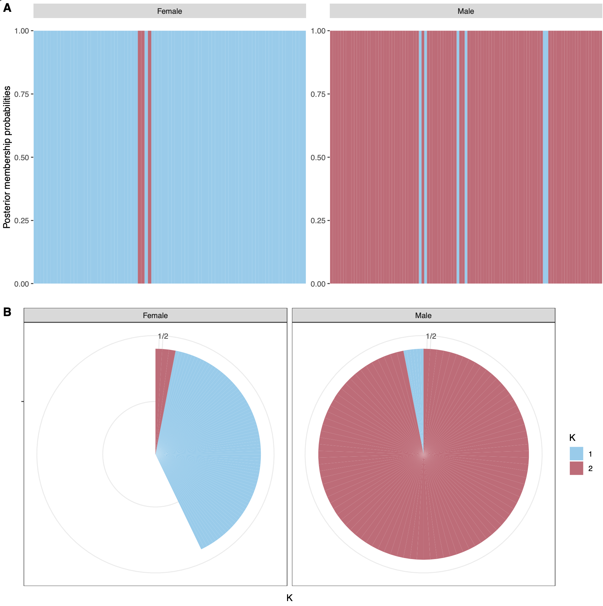
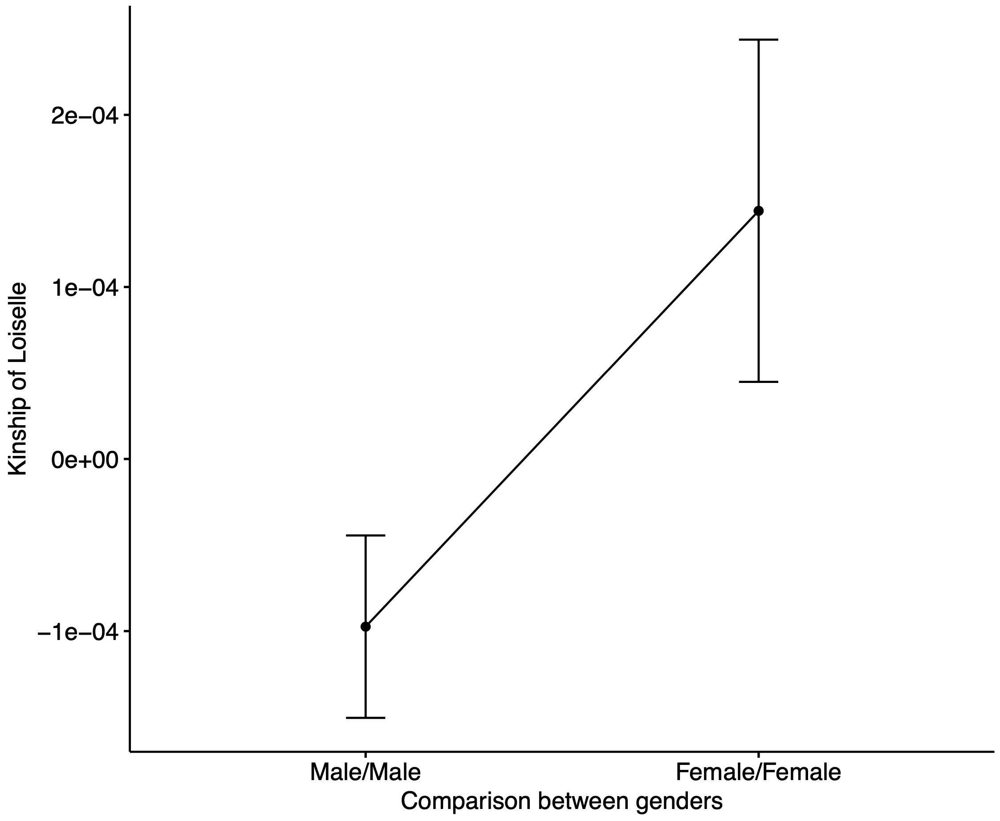
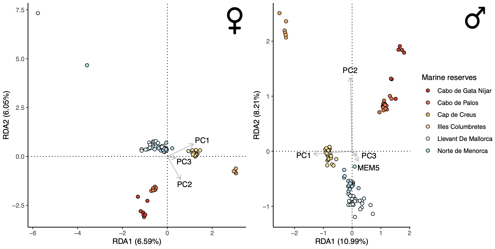
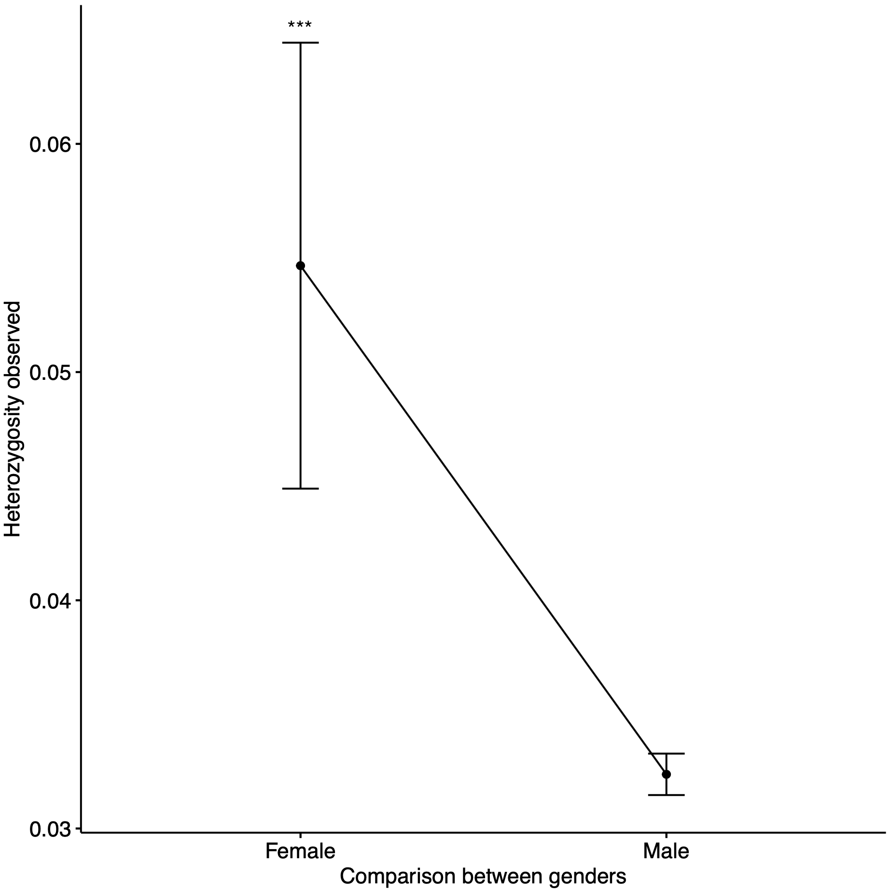

# sex_lobster
Investigating the influence of fishing on male and female lobster.

## 1. Sampling

</img>

## 2. Outlier detection

We use `pcadapt`to test for local dapatation in *P. elephas*.
We apply a conservative cut-off by selecting only markers in the top 1% of the P-values distribution.
We discover a total of 833 snps putatively under divergent selection out of 83372snps genotyped on 243 individuals.

</img>

## 3. Population structure

### Adaptive population structure

Using ADMIXTURE and a Discriminant Analysis of Principal Components (DAPC) available in the [adegenet package](https://www.rdocumentation.org/packages/adegenet/versions/2.0.1), we run our script `adaptive_structure`. 
We observe complete panmixia, which is likely due to the life history traits of this species (e.g. long pelagic duration phase). This result consider all the putatively neutral genetic markers (25230 SNPs).

We decide to look for population structure using the set of SNPs putatively under divergent selection by performing the script `adaptive_structure.R`.
When we look at these highly differentiated regions of the genome, we highlight that 272 SNPs are linked to gender information, meaning that these markers are probably located to sex chromosome (hereafter called sex-linked markers) and in autosome.

</img>

## 4. Sex-linked markers

Genetic diversity, which reflects the potential of a species to cope with environmental change, is significantly different if we include this sex-linked markers than if we remove it, meaning that, without gender information, we may have biased our genetic diversity estimates and then make wrong recommendation for conservation planning.


Then, we investigate the hypothesis of sex-bias dispersal by calculating the degree of relatedness for male and female, separately.
We detect a subtle difference, males being less relative than female, but it turns out that this difference is not significant (Wilcoxon test, P-value = 0.10).

</img>

## 5. Seascape genomics

We remove sex-linked markers and consider each sex separately (female and male) to perform a distance-based analysis available in the package [vegan](https://www.rdocumentation.org/packages/vegan/versions/2.4-2/topics/capscale) with the script `dbRDA-per-sex.R`. 
We find that males seems more influenced by the seascape than females, with seascape features explaining more genomic variation in males than in females (21% was explained by seascape features versus 12% in female). 

Males tend to disperse more during the fishing season (April-May), and there is more competition for males than females during the mating season (August). We have individuals collected from April to December 2017, so we cover both seasons (fishing season and later, mating season). This particular behaviour (higher dispersal rate, more competition) of the males may partly explain why we found that the environment has a greater influence on the male than on the female. 

</img>

## 6. Analysis of genetic diversity 

We uncover a difference in genetic diversity between males and females, females show higher genetic diversity than male, even when we consider non sex-linked markers.
We hypothesize that fishing pressure may be greater on male lobsters than on female lobsters, which may explain the loss of genetic diversity estimated for this sex compared to females 

</img>

To complement this analysis, we estimate the effective size of the females and males separately, using [COLONY](https://www.zsl.org/science/software/colony). 

----------------------------------------------------------------------------------------------------
Estimates by Colony full likelihood method : Assuming random mating
|----------------------------------------------------------|
|Female|
|Ne      =         12960|
|CI95(L) =          4325|
|CI95(U) =    2147483647|
|---------------|
|Male|
|Ne      =    2147483647|
|CI95(L) =             1|
|CI95(U) =    2147483647|
---------------

We observed a higher Ne values for male than female, but a lower interval values (1) than female (4325).

## 7. Bottleneck test using dadi

First **create a vcf that contains all SNPs** called with STACKS. 
Filter for missing values and depth coverage using the following command:

``` {r}, engine="bash",
vcftools --vcf yourvcffile --missing-max 0.95 --min-meanDP 20
```

Then, estimate allele frequencies using this filtered VCF.
``` {r}, engine="bash",
vcftools --freq --vcf tonvcf
```

Finally transform the allele frequencies output with the `.freq`extension from vcftools to an approriate dadi format with bash langaguage and a R script.

``` {r}, engine="bash",
sed 's/:/\t/g' tonvcf.frq |sed 1d > tonvcf2.frq #pour remplacer les ":" et supprimer le header
```

Run the script R with the following command:

``` {r}, engine="bash",
Rscript spectre_1pop.R yourvcf2.frq
```

Convert the file in input for dadi and visualize the file according to https://dadi.readthedocs.io/en/latest/user-guide/installation/
Open python and run the script `dadi_creation_spectre1pop.py

